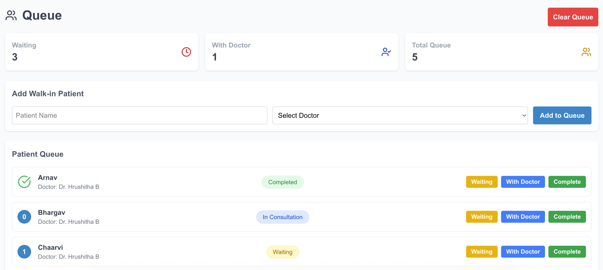
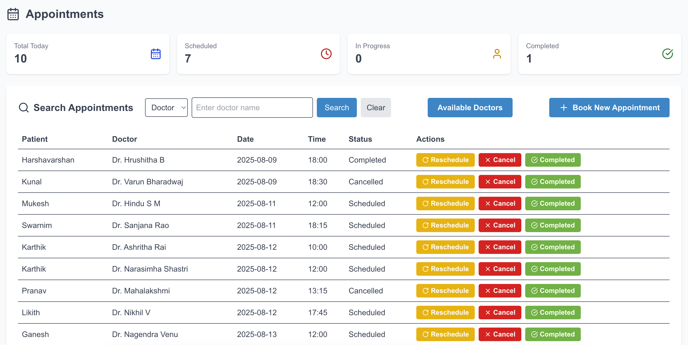

# Clinic Front-Desk Management System  
*(Built as a part of an assignment for Allo Health)*

## Live Demo
https://clinic-front-desk-frontend.vercel.app/

## Project Overview  
This is a full-stack clinic management system focusing on queue management, doctor and patient handling, and appointment booking. Built with Next.js and React on the frontend and a REST API backend.

---

## IMPORTANT NOTES
- The project was built from scratch according to assignment requirements, with all necessary steps taken to ensure smooth functionality.
- Login Credentials: Username - `admin`, Password - `admin123`
- Database Credentials: *(For project reviewer use only)*  
  Host: sql12.freesqldatabase.com  
  Database name: sql12794205  
  Database user: sql12794205  
  Database password: ywCn3jKJQs  
  Port number: 3306
- Frontend is deployed on Vercel and backend on Render. Initial backend connection may take about 30 seconds. Please be patient.
- The website is partially responsive, with the main focus on queue management and appointment booking functionality. For the best experience, please use a desktop browser.
- If you encounter common CORS or 500 errors on navigation, reload multiple times as the database might still be loading.
- The Dashboard page is a placeholder frontend and can be integrated with backend APIs for real-time data in future updates.
- A dataset of 100 doctors across 10 locations is pre-loaded to simulate realistic data and test queries.
- Sample appointments and queue patients are also seeded for demonstration.
- The project focuses on workflow and functionality rather than UI design, which can be enhanced later as needed.

---

## Tech Stack  
- Next.js (React)  
- REST API backend (hosted on Render)  
- Axios for API calls  
- Tailwind CSS for styling  
- Lucide Icons for UI icons  

---

## Project Objectives  
- Real-time queue numbering and status management  
- Role-based access control for secure user interactions  
- CRUD operations for doctors and patients  

---

## Assumptions & Constraints  
- Authentication is token-based but does not implement OAuth or full JWT validation.  
- Data persistence relies on the backend REST API (either mocked or real).  
- Backend response times may vary, so frontend includes error handling and loading states.  

---

## Quick Setup & Testing  
1. Clone the repo  
2. Run `npm install`  
3. Run `npm run dev`  
4. Navigate to `/doctors` for doctor management  
5. Navigate to `/queue` to test patient queue flow  
6. Navigate to `/appointment` to book appointments  

---

## Known Limitations  
- Backend may take time to initialize, causing temporary errors on first load.  
- Dashboard is currently static and for demonstration only.  
- UI styling is minimal and can be improved for production.  

---

## What I Learned  
Balancing user experience with backend consistency was challenging but rewarding. This project enhanced my skills in React state management, asynchronous data handling, and real-time queue logic implementation.

---

## Contact  
- Phone: +91 8792876217  
- Email: kushalj400231@gmail.com  
- LinkedIn: [https://www.linkedin.com/in/kushalj1/](https://www.linkedin.com/in/kushalj1/)  

---

## Project Images  
  
  
  
  
  